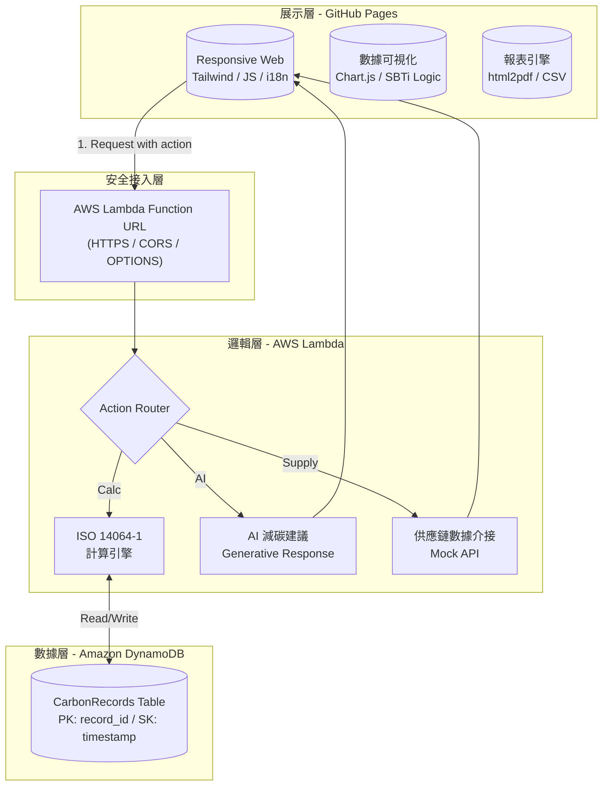

# 系統架構與規格設計書：企業綠色融資暨智慧碳管理平台

## 1. 專案簡介 (Project Introduction)

### 1.1 系統開發背景與目的
在 ESG 浪潮下，企業面臨國際供應鏈與金融機構對於碳排數據的高標準要求。本系統旨在建立一個自動化、具備稽核軌跡且符合國際標準的碳管理平台。

本專案採用的技術亮點：
*   **國際化支援**：支援中/英雙語系即時切換，符合國際金融業務場景。
*   **雲端原生架構**：完全基於 **AWS Serverless**，具備高擴展性與極低維護成本。
*   **智能診斷與整合**：內建 **AI 減碳診斷**、**SBTi 目標追蹤**與**供應鏈 API 模擬**。

---

## 2. 系統架構設計 (System Architecture)

### 2.1 技術架構圖 (Tech Stack Diagram)
本系統採用「前後端分離」與「微服務分流」的思維設計。

### 2.2 技術元件說明
*   **展示層 (Frontend)**：使用 HTML5/Tailwind CSS 建構，邏輯由純 Vanilla JS 驅動，確保輕量化。i18n 模組透過字典檔實現即時語系切換。
*   **業務邏輯層 (Backend)**：核心為單一 AWS Lambda 函數，透過 `action` 參數進行路由分發，實現「單一端點、多種功能」的設計。
*   **數據層 (Database)**：採用 NoSQL 資料庫 DynamoDB，設計為複合主鍵（Composite Key）結構，優化查詢與精準刪除的效能。

---

## 3. 業務功能規格 (Functional Requirements)

| 需求編號 | 功能模組 | 描述 | 備註 |
| :--- | :--- | :--- | :--- |
| **FR-01** | **雙語切換機制** | 系統首頁與內部介面提供中/英切換按鈕。 | 使用 i18n Dictionary 實現。 |
| **FR-02** | **角色權限控管 (RBAC)** | 登入輸入 `admin` 即可解鎖進階模組，否則僅能使用基礎計算。 | 模擬金融系統之權限分級。 |
| **FR-03** | **ISO 14064 試算引擎** | 計算範疇一、二、三排放量，並將 `user_id` 綁定寫入資料庫。 | 建立稽核軌跡 (Audit Trail)。 |
| **FR-04** | **SBTi 路徑追蹤** | 視覺化對比企業實際碳排與 1.5°C 減碳路徑目標。 | 提供管理決策依據。 |
| **FR-05** | **供應鏈 API 同步** | 模擬透過 API 從供應商獲取碳數據並整合至儀表板。 | 展示系統集成能力。 |
| **FR-06** | **AI 智慧診斷** | 呼叫雲端邏輯分析碳排熱點，生成針對性的減碳建議。 | 強化 ESG 顧問價值。 |
| **FR-07** | **數據管理與刪除** | 提供歷史紀錄列表，並具備精準刪除單筆紀錄之功能。 | 串接後端 DELETE 路由。 |

---

## 4. 非功能性需求 (Non-Functional Requirements)

### 4.1 安全性 (Security)
*   **HTTPS 傳輸**：確保資料傳輸過程加密。
*   **CORS 原生控制**：後端程式碼嚴格檢查來源 Domain 與 Method，防止跨站攻擊。
*   **權限攔截**：前端 UI 與後端 Logic 雙重檢查 Admin 權限標記。

### 4.2 效能與可用性 (Performance)
*   **低延遲**：數據掃描 (Scan) 限制在 Lambda 端進行排序，確保前端呈現流暢。
*   **高可用**：依託 AWS 亞太區域 (ap-northeast-1) 機房，具備 99.9% 服務可用性。

---

## 5. 介面設計規格 (API Specifications)

*   **Endpoint**: `AWS Lambda Function URL`
*   **Protocol**: HTTPS (TLS 1.2+)

#### POST / (功能分流)
| Action 參數 | 描述 | 輸入範例 |
| :--- | :--- | :--- |
| `(Default)` | 執行碳排計算並存檔 | `{ "user_id": "...", "power": 500, ... }` |
| `ai_diagnosis` | 執行 AI 減碳分析 | `{ "action": "ai_diagnosis", "lang": "zh" }` |
| `fetch_supply` | 獲取供應鏈數據 | `{ "action": "fetch_supply" }` |
| `generate_audit`| 生成稽核狀態驗證 | `{ "action": "generate_audit" }` |

#### DELETE / (資料刪除)
*   **Payload**: `{ "record_id": "...", "timestamp": "..." }`
*   **邏輯**: 必須同時比對 PK 與 SK 始可執行刪除。

---

## 6. 安裝與執行 (Installation)

1.  **資料庫**：在 DynamoDB 建立 `CarbonRecords` 表，Partition Key 定義為 `record_id` (S)，Sort Key 定義為 `timestamp` (S)。
2.  **後端**：部署 `lambda_function.py`，配置 Lambda Function URL，並開啟程式碼層級的 CORS。
3.  **前端**：將 `index.html` 內的 `lambdaUrl` 指向您的 Function URL，上傳至 GitHub 並開啟 GitHub Pages。

---
*本文件由 碳吉 TanJi 編寫，作品受著作權法保護，未經授權請勿複製轉載。*
